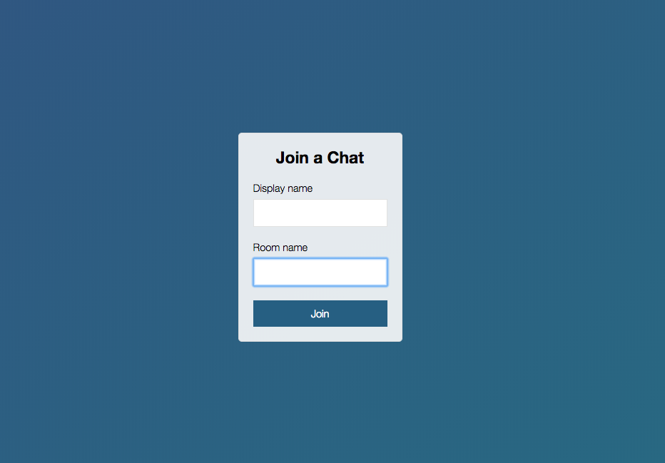
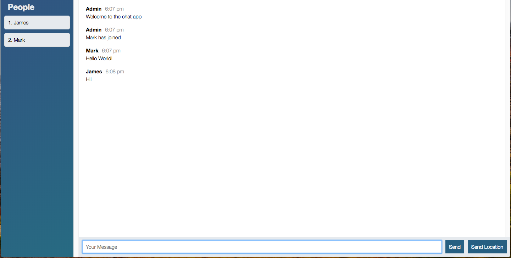

# node-chat-app

This app is a real-time chat app that allows multiple users to create and enter chat rooms for communicating with other users. 

## Features

* Users can login to a chat room 
* When new user enters the chat room, admin sent a welcome message 
* Other users receive a massage that informs new user has entered
* A list of all users in a char room is shown 
* Users can send their geolocation information link 

## Landing Page & Chat room 

## Technologies used

* Node js 
* Express 
* Socket.io 
* JavaScript 
* jQuery 
* Heroku

Heroku link : https://mighty-plateau-43414.herokuapp.com/
